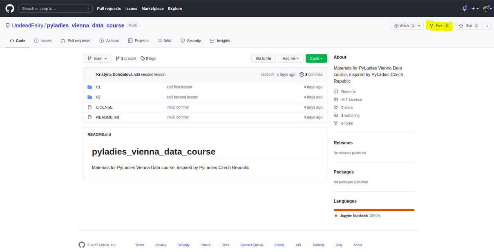
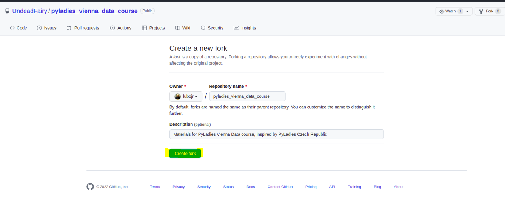
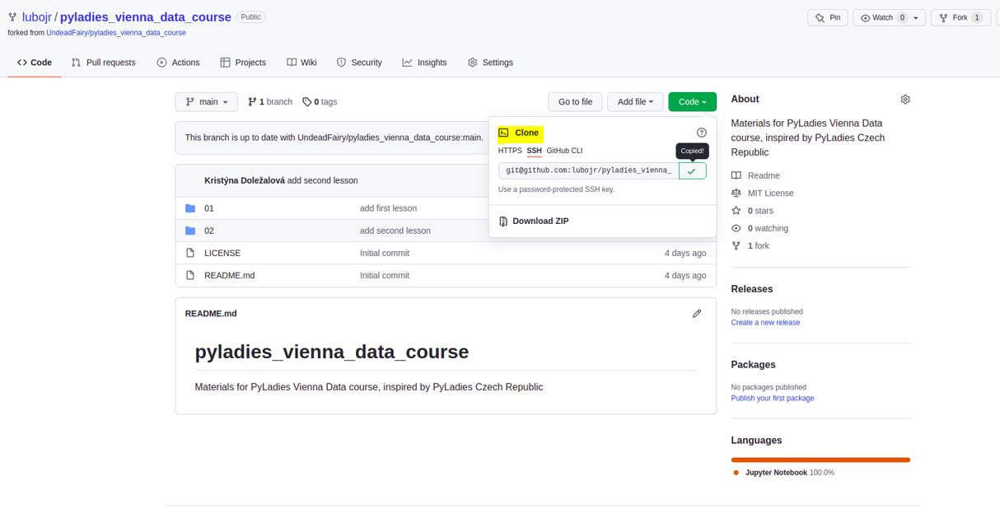
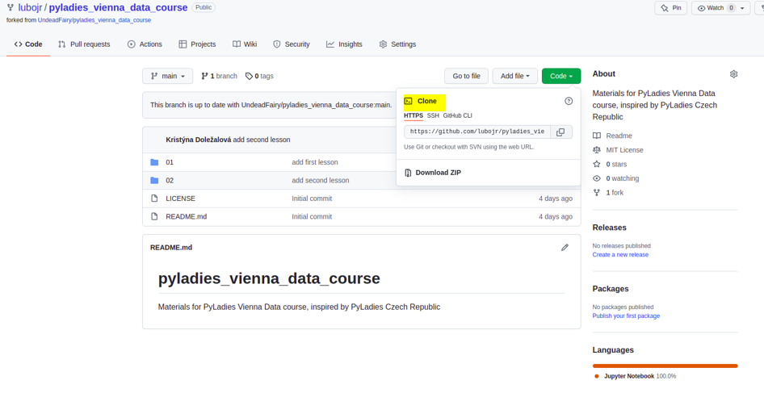
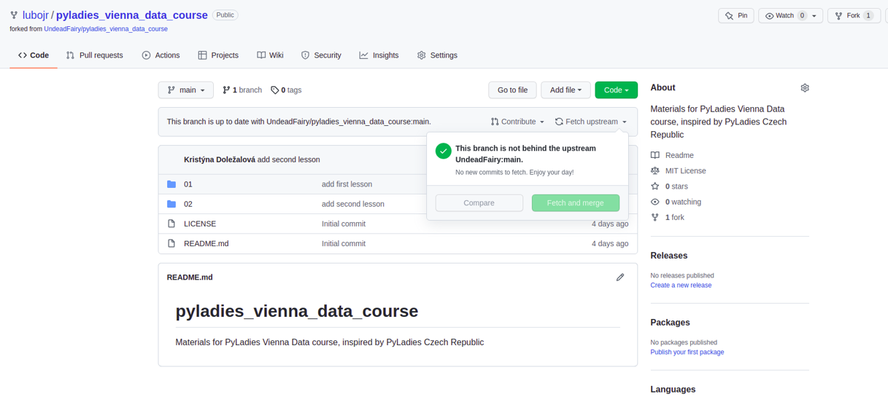
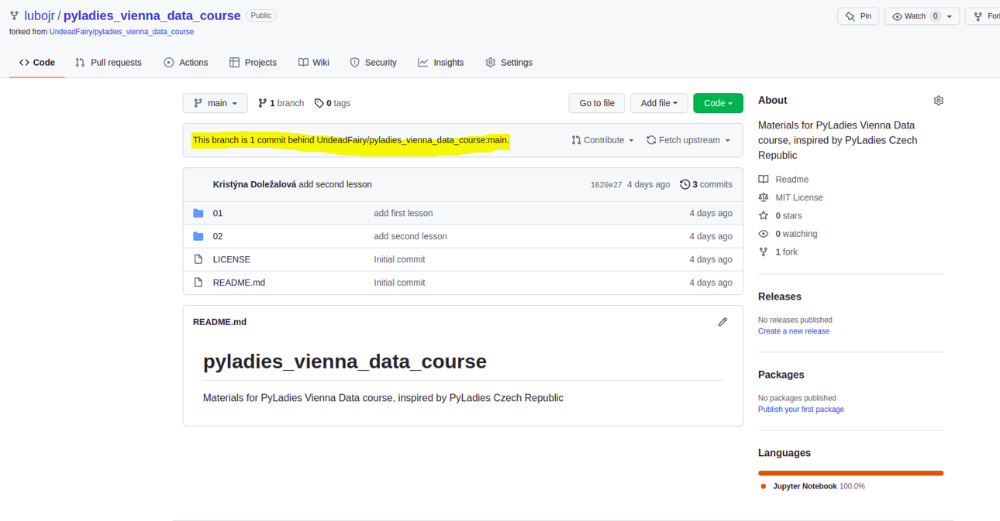
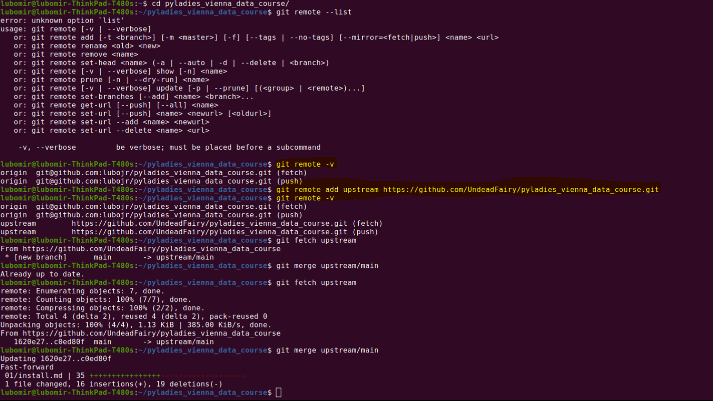
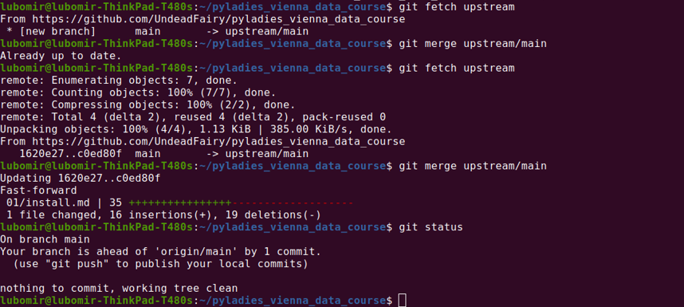

# Github Fork

For your own comfortable working during this course, we recommend to fork our repository with all materials. You can find the repository [here](https://github.com/UndeadFairy/pyladies_vienna_data_course).

If you are not sure how to, here is step-by-step guide for you. 

## Step 1 

After login into GitHub, click on Fork in upper right corner 


If you do not wish to change a name of your repository, click on Create Fork one more time.


## Step 2 

Your version of original repository is created! Now it is time for you to clone it to your machine and start to use it. So clone repository either using ssh (if you have it set up) or using https:

SSH version  and HTTPS

It should look similar to this in your terminal if you clone it correctly:


## Step 3

Now we want to ensure that when the lecturers of the course add new materials, you will know about it and you can get them to your version of repository. If you go back to your GitHub and in the meantime somebody pushed new changes, you should see something similar.

and 


So we should set it up on your machine to get the changes for you.
We will setup another remote in your terminal - not only your GitHub fork of the repository, but also ours. To do that, type following command, where `upstream` is a name of second remote (take it just as a convention, not a hard rule)
```shell
$ git remote add upstream (url of original repository .git)
```

after typing 
```shell
$ git remote -v
```
you should now see `upstream` `remote` added



and finally you can do 
```shell
$ git fetch upstream
``` 
to collect all changes that have happened in the `upstream` and 

```shell
$ git merge upstream/main 
``` 

to merge all fetched changes into your local branch. Now you are ready to work on latest documents!

