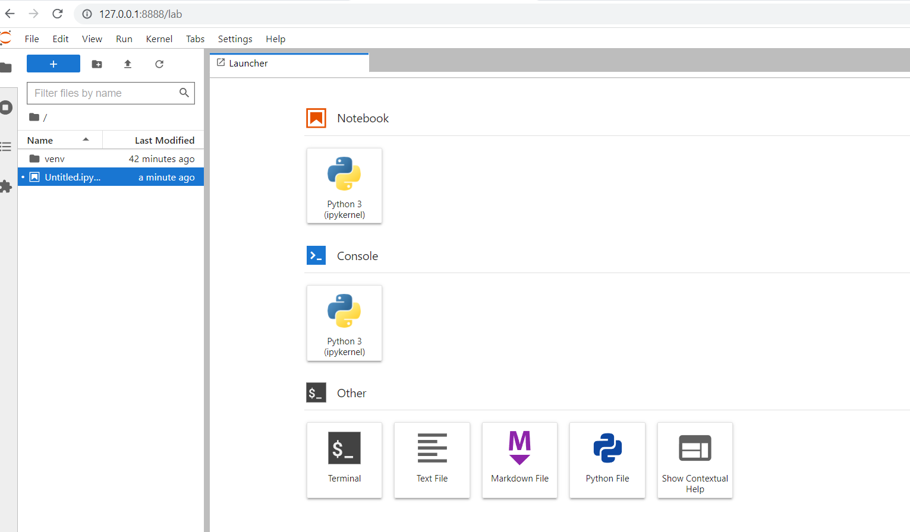
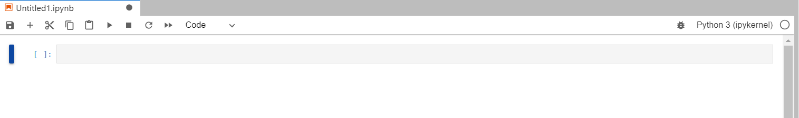
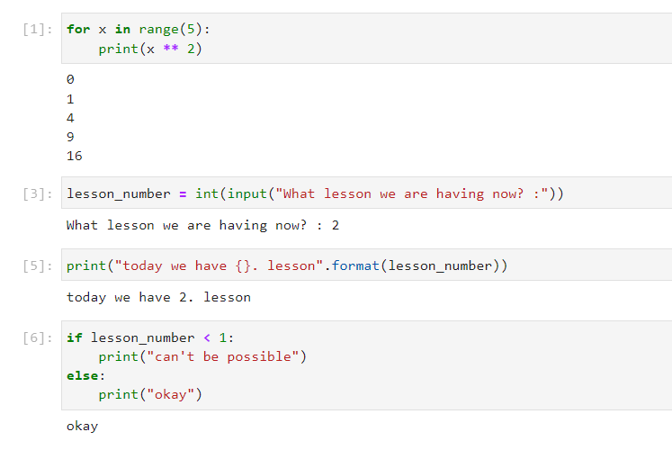
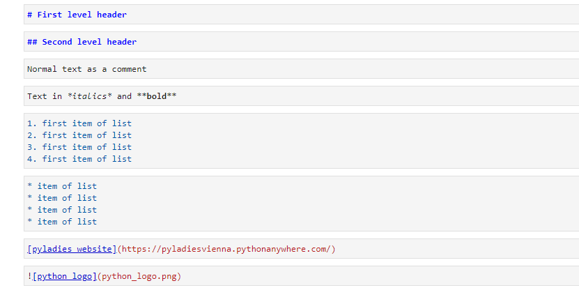
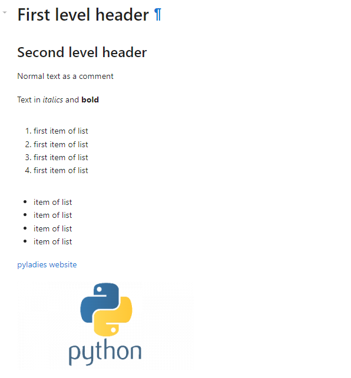

# Jupyter Notebook intro

Jupyter Lab (and its Notebook) is a web editor used to create complex documents,
which may include structured text and images as well as
code ([not only in Python](https://github.com/jupyter/jupyter/wiki/Jupyter-kernels)),
graphs, mathematical formulas (LaTeX) and other interactive elements.

From another point of view, this is a very practical console for Python, where everything is saved and can be returned or changed, affecting the follow-up
calculations. 

Jupyter Notebook is suitable wherever you need to see the results immediately,
or you want to work step by step and check intermediate results, pass someone a comprehensive program together with visualizations and results, prepare a presentation or data analysis, etc.

## Launch

After successful installation, Jupyter Lab can be run in an active virtual environment
with a simple command:

```shell
(venv) $ jupyter lab
```

If this command doesn't work for you, try using just jupyter notebook:

```shell
(venv) $ python -m notebook
```

When you start the Notebook, the web browser (which is setup as default - this could be of course changed) will also start automatically
 and your jupyter editor will be displayed.

> The notebook always works in the folder in which it was started, so it is reasonable go to the folder in which you want the resulting documents be saved before starting it.



On the first screen you see the contents of the folder in which the Notebook is running. Once you will have some documents created, they will appear here and you will be able to return to them and continue working anytime. You can also create subfolders manually.

To create a new document, click on ` Python 3` in ` Notebook` section.
This option selects Python 3 as the language you will use within the document.


## The user interface



The notebook does not have a complicated interface. On the first line you will find information about the name of the
document and the last save, then the controls and the main menu.
A little lower you can find an empty cell waiting for the first content.

To the right - next to "Python 3" there is a small but useful circle. If it is filled 
black, it means that Python is busy executing your commands and you need
to wait for them to finish. Additionally if some unintended bug like an infinite loop is created that requires Python (or kernel) to be restarted, you can do that also here.

## Basic use

As a first step, rename the new document. Click on the inscription on the first line "Untitled", select rename notebook and choose a meaningful name.

Now try to type a command in Python in the first cell and press the keyboard key
shortcut `Shift` +` Enter`.

> An arbitrarily large piece of code can be written in one cell, even with empty lines, therefore
a keyboard shortcut must be used instead of just Enter to run it.
However, it makes more sense to divide the code into smaller parts so that it can be better controlled.


You can continue in the same way. You always enter a code in a cell and then
you just run it. If the cell contains any output or returns something, the result is displayed right below it. However, this only applies to the last output of the cell. If you want to see more, usage of `print` is needed.


It works like a classic program, so it depends on the order in which the individual cells are executed. For example, you must first store some content into a variable before you will be able to use it. This rule is important to keep in mind because cells inside the notebook can be started independently of each other and in any order. In what order cells where started can be determined from the numbers that are displayed in square brackets to the left of the cell. If `*` appears instead of a number after startup, it means that
Python is working and we will have to wait a while for the result.

This is what it might look like if the correct order is not followed:


> Although it is not a necessity, it is customary to write documents in a notebook in order to let
the cells run in the order in which they follow each other. Then if you send it to someone,
they will be able to easily run your code cell by cell and keep track of what is going on. In addition, the main menu also has the option `Kernel`>` Restart & Run All`, which
restarts Python and then starts all cells in the document.

Notice how the cells change the color. If the edge of the cell is green, it is possible to
edit and use the arrows to move through the code inside. If it's blue, you can use arrows to move between cells. From blue to green mode
we get to the `Enter` key, or by clicking in the cell. On the contrary, from the green to blue mode using the `Esc` key.

To control your notebook it is good to learn the keyboard shortcuts. It will make your life much easier and productive. Their list can be found for example [here](https://towardsdatascience.com/jypyter-notebook-shortcuts-bf0101a98330).

> Keyboard shortcuts can be used in blue mode, otherwise you would instead
special events wrote individual characters into the cells.

Among the most important are:

* `a` inserts a new cell above the current one
* `b` inserts a cell below the current one
* `x` extracts the cell
* `c` copies the cell
* `v` inserts a coppied cell below the current one
* `Shift` +` v` pastes the copied or cut cell above the current one
* `Ctrl` +` s` saves the document
* `m` switches a cell from python code to text (markdown)


## Content types

The basic cell type is a code cell that can do everything from Python
you already know.



### Text

By pressing the `m` key (in blue mode) we can switch the cell from python mode
code to text mode, which allows us to enrich documents with a lot of different content.
We know that the cell is in text mode by the fact that it will no longer be blue to the left of it and
`[]` symbol is gone. While for cells with Python code we get the result after running the program below the cell, the text cell is rendered as text when run.

### Markdown

An ordinary text would not be so interesting and will not contribute to clarity
more than just as a comment. Therefore, we have the ability to format it and to some extent adjust the visual, but mainly work with the structure. For formatting is used 
Markdown language (https://en.wikipedia.org/wiki/Markdown). Markdown
allows you to format text directly by using plain characters.

For example:

* Text beginning with `#` and space will automatically become the first header when the cell is run. `##` will be a second level header and etc. 
* If we introduce the text with asterisks - `* for example *` - it will be written *in italics*.
A pair of asterisks on each side will then make the text **bold**.
* When several lines start with an asterisk, they become a bulleted list.
When we use numbers at the beginning, the list will be numbered.
* Links look like this: `[link text](path or URL)` - to square
the text of the link is written in square bracets at the beginning and the path to the destination or URL in parentheses.
* Images look almost the same as links, only they have at the beginning 
exclamation mark: ``

Simply formatted text in this way could look like this:



The result of such formatting can then look like this:



### Mathematical formulas

If you know the notation of mathematical formulas that is used in LaTeX, you can
use it in notebook cell as well. Just start and end the latex formula
using `$` (or `$$`).

Examples of several entries:


If you need formulas and this notation is new to you, there is no need to learn
everything about LaTeX, you just need couple of simple characters. For example, [this help](https://en.wikipedia.org/wiki/Help:Displaying_a_formula) from wikipedia can help you.

## Other useful features

The notebook has a number of conveniences that make it easier for us to work with it.

### Help

When you type a question mark after the name of a function (instead of parentheses) or a module
(eg: `print?`), a help will appear after running such a cell. 

Shorter help (so-called documentation string) can be displayed while writing code using
keyboard shortcuts `Shift` +` Tab`. This displays the documentation string of the function
in a small bubble near the active cell.

### Special commands

Commands beginning with a percentage sign have a special meaning in notebooks. For example
`% time` can measure and display how long it took to execute the code written on the line immediately following this command.

Special commands starting with two percent (eg: `%% time`) then have an effect on the whole
cell instead of one row.

A list of all special commands can be obtained with `% lsmagic`.

### Command line commands

It is also very easy to run commands from the command line in notebook cells.
Instead of running Python, just start with a command line
(eg: `!whoami`)

## To continue

The notebook can do a lot and we will also write all course materials as jupyter notebooks so you can try to run them by yourself directly. This will allow you to combine directly practice with theory you learned and write your own extra comments into study materials.

However, the development of classic applications and in general for projects with a more complex structure it is still
better to divide code into modules and edit it in a suitable code editor.
It is common practice to first quickly assemble a prototype in interactive python (notebooks) and after testing transform it into runnable Python code functional in an interactive laptop environment
prototype and then transform it into a classic application structure.
